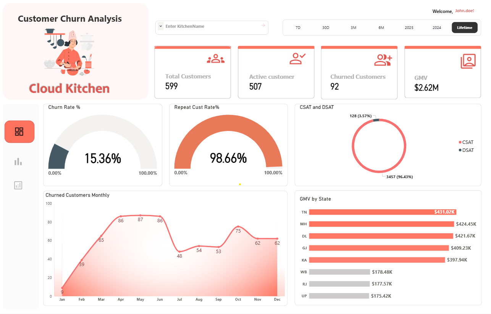
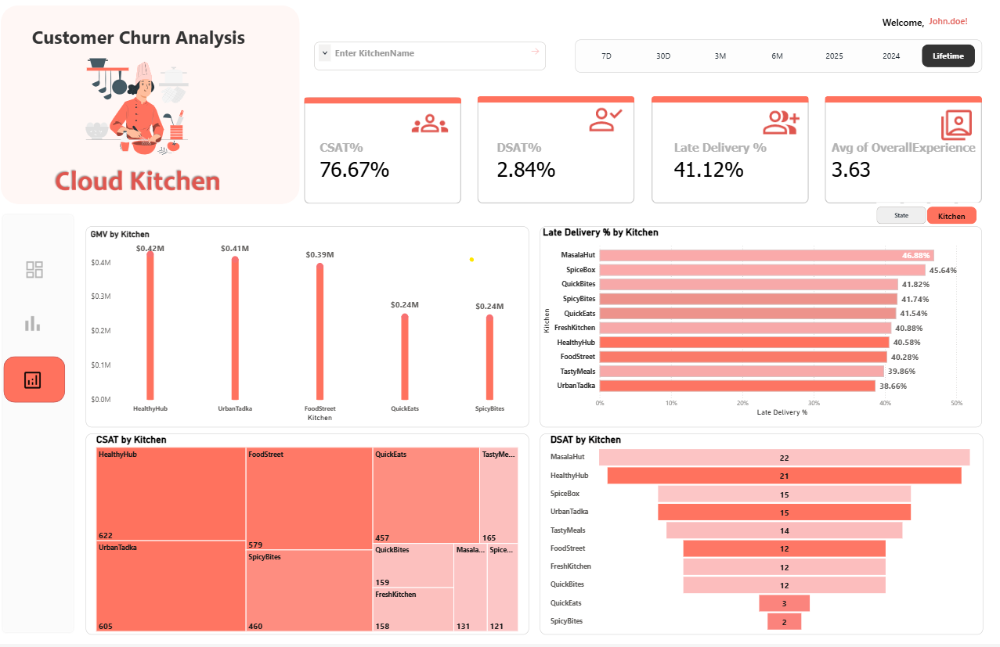

# Customer Churn & CSAT Analytics Dashboard
**Cloud Kitchen Business | 2024-2025**

## 📌 Project Overview
This Power BI dashboard analyzes customer churn and satisfaction metrics
for a Cloud Kitchen business across multiple kitchen brands and states in
India. It helps identify at-risk customers, track repeat vs churned behavior,
and evaluate service quality through CSAT and DSAT scores.

## 🔗 Live Dashboard Link
👉 **[Customer Churn & CSAT Dashboard](https://app.powerbi.com/reportEmbed?reportId=a497ce43-37e0-4390-9ae3-aee4b1155cec&autoAuth=true&ctid=66b1ab0e-93ce-4dcb-a1c9-5645b0675d8e)**

## 📊 Key Insights
- **15.36% Churn Rate** with 92 churned out of 599 total customers
- **98.66% Repeat Customer Rate** indicating strong loyalty among active users
- **$2.62M GMV** tracked across states — TN, MH, and DL lead in revenue
- Churn is highest in the **1+ Year** and **0–30 Days** tenure buckets
- **QuickEats** and **SpicyBites** show 100% churn rate by kitchen
- **CSAT: 76.67%** | **DSAT: 2.84%** | **Late Delivery: 41.12%**
- **MasalaHut** has the highest late delivery % (46.88%)
- **HealthyHub** leads in CSAT count; **MasalaHut** has highest DSAT count

## 🖼 Dashboard Screenshots

### Overview

### Churn Deep Dive

### CSAT & DSAT Analysis

## 🛠 Tools & Technologies
- Power BI
- DAX
- Power Query
- Data Modeling
