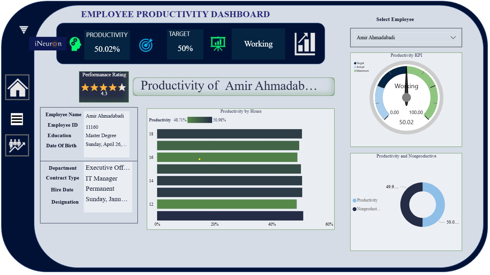
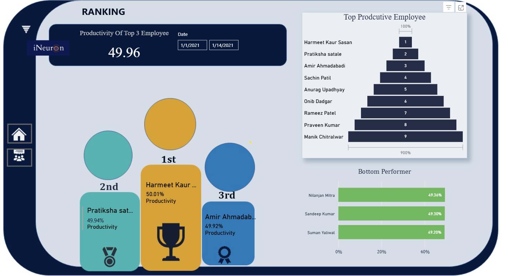

# Employee Productivity Dashboard

## 📌 Project Overview
Analyzed employee productivity using behavioral and facial emotion tracking data to understand engagement and performance patterns.

## 🔗 Live Dashboard
👉 [Click here to view the live Power BI dashboard](https://app.powerbi.com/view?r=eyJrIjoiZmIwZTMyNTYtNWIyMS00NDQ5LWI2ZGItMzZiN2I2MzlhNjlkIiwidCI6ImU2YjdmNGQ3LTAyNGQtNDA1MS05NWM5LTM5MGVjZTFmYmFhMCJ9)

## 📊 Key Insights
- Productivity and engagement trend analysis
- Emotion-based behavior tracking
- Department-wise performance comparison
- Custom KPIs for productivity evaluation

## 🛠 Tools & Technologies
- Power BI
- DAX
- Data Visualization

## 🖼 Dashboard Preview

