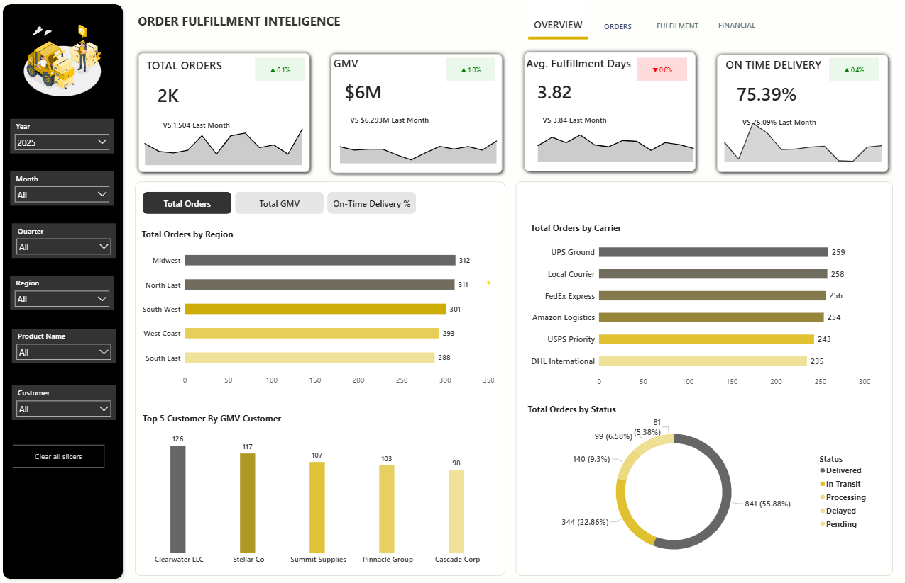
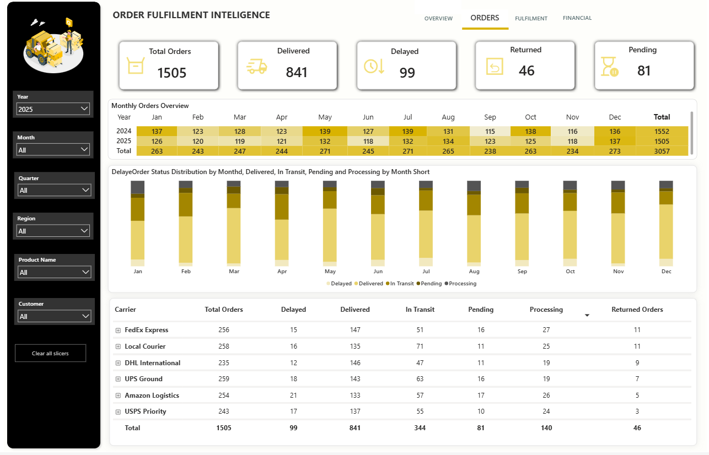
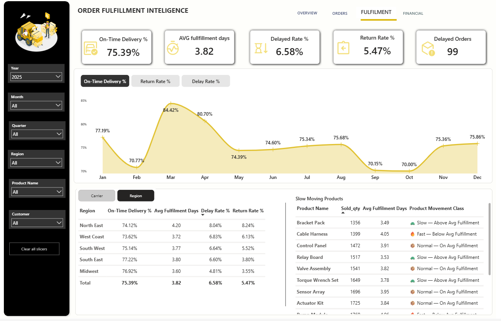
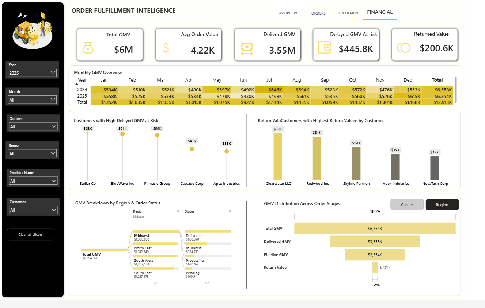

# 🚚 Supply Chain Analysis Dashboard

## 📌 Project Overview
A Power BI dashboard analyzing supply chain performance including inventory, suppliers, and logistics.
## 🔗 Live Dashboard
👉 [Click here to view the live Power BI dashboard](https://app.powerbi.com/view?r=eyJrIjoiYWY2MmJhYzEtMDM2Yy00MTQwLWJmYTMtNzdlYTM2NzRmYjZiIiwidCI6IjY2YjFhYjBlLTkzY2UtNGRjYi1hMWM5LTU2NDViMDY3NWQ4ZSJ9)

## 📊 Dashboard Pages
### 1. Overview

### 2. Inventory Analysis

### 3. Fullfilment KPI Performance

### 4. GMV Analysis

## 🛠 Tools Used
- Power BI Desktop
- Excel / SQL (data source)

## 💡 Key Insights
* Order fulfillment performance tracking across regions and carriers
* Customer-wise GMV contribution and order volume analysis
* Delivery status monitoring with pipeline bottleneck identification
* On-time delivery rate trends with month-over-month comparison
* Carrier performance evaluation across multiple logistics partners
* Regional demand distribution and order fulfillment intelligence

## 📂 Dataset
- Source: (mention where data is from)
